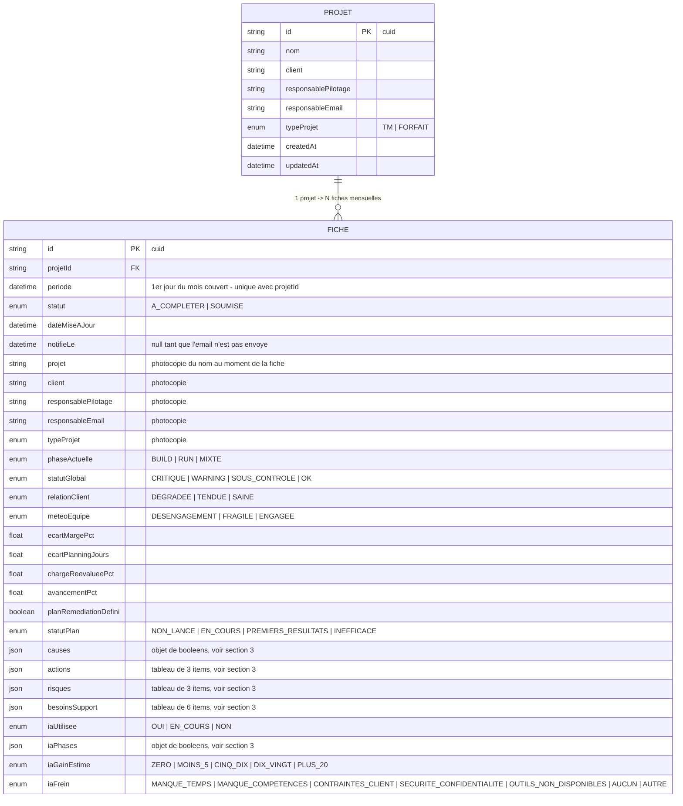

# Modèle de données — ProjetCommand

Source de vérité : [`prisma/schema.prisma`](../prisma/schema.prisma). Ce
document en donne une vue lisible pour un développeur ou un consommateur de
données (PowerBI), sans avoir à parser le schéma Prisma.

Base : **PostgreSQL** (2 tables, `Projet` et `Fiche`, en relation 1-N).

## 1. Schéma entité-relation



**Contraintes clés à connaître** :
- `Projet` est unique par `(nom, client)`.
- `Fiche` est unique par `(projetId, periode)` — une seule fiche par projet
  et par mois. `onDelete: Cascade` : supprimer un `Projet` supprime toutes
  ses fiches.
- **Il n'y a pas de notion de projet parent/enfant.** La seule relation
  hiérarchique dans le produit est temporelle : pour un même `projetId`,
  plusieurs `Fiche` s'accumulent dans le temps (une par mois). La fiche dont
  la `periode` est la plus récente est la "fiche courante" ; les autres sont
  "historisées" (lecture seule côté app). Voir
  [`docs/ARCHITECTURE.md`](./ARCHITECTURE.md#fiche-courante-vs-historisée).

## 2. Dictionnaire des champs `Fiche`

| Section | Champ | Type Postgres | Enum / format | Nullable |
|---|---|---|---|---|
| Rattachement | `projetId` | text (FK) | — | non |
| Rattachement | `periode` | timestamp | 1er jour du mois | non |
| Rattachement | `statut` | enum | `A_COMPLETER`, `SOUMISE` | non (défaut `SOUMISE`) |
| Rattachement | `notifieLe` | timestamp | — | oui |
| A. Général | `projet`, `client`, `responsablePilotage`, `responsableEmail` | text | — | non (email défaut `""`) |
| A. Général | `typeProjet` | enum | `TM`, `FORFAIT` | non |
| A. Général | `phaseActuelle` | enum | `BUILD`, `RUN`, `MIXTE` | non |
| B. Indicateurs | `statutGlobal` | enum | `CRITIQUE`, `WARNING`, `SOUS_CONTROLE`, `OK` | non |
| B. Indicateurs | `relationClient` | enum | `DEGRADEE`, `TENDUE`, `SAINE` | non |
| B. Indicateurs | `relationClientCommentaire` | text | — | oui |
| B. Indicateurs | `meteoEquipe` | enum | `DESENGAGEMENT`, `FRAGILE`, `ENGAGEE` | non |
| B. Indicateurs | `signauxFaibles`, `departsCles` | text | — | oui |
| C. Dérive | `causes` | **jsonb** | objet, voir §3 | non |
| C. Dérive | `difficultesMaitrisables`, `difficultesNonMaitrisables` | text | — | oui |
| C. Dérive | `ecartMargePct`, `ecartPlanningJours`, `chargeReevalueePct`, `avancementPct` | float | — | oui |
| C. Dérive | `ecartMargeCommentaire`, `ecartPlanningCommentaire`, `chargeReevalueeCommentaire`, `avancementCommentaire` | text | — | oui |
| D. Plan d'action | `planRemediationDefini` | boolean | — | non |
| D. Plan d'action | `statutPlan` | enum | `NON_LANCE`, `EN_COURS`, `PREMIERS_RESULTATS`, `INEFFICACE` | oui |
| D. Plan d'action | `actions` | **jsonb** | tableau de 3, voir §3 | non |
| D. Plan d'action | `risques` | **jsonb** | tableau de 3, voir §3 | non |
| D. Plan d'action | `besoinsSupport` | **jsonb** | tableau de 6, voir §3 | non |
| E. IA | `iaUtilisee` | enum | `OUI`, `EN_COURS`, `NON` | non (défaut `NON`) |
| E. IA | `iaPhases` | **jsonb** | objet de booléens, voir §3 | non (défaut `{}`) |
| E. IA | `iaGainEstime` | enum | `ZERO`, `MOINS_5`, `CINQ_DIX`, `DIX_VINGT`, `PLUS_20` | non (défaut `ZERO`) |
| E. IA | `iaCasUsagePrincipal` | text | — | oui |
| E. IA | `iaFrein` | enum | `MANQUE_TEMPS`, `MANQUE_COMPETENCES`, `CONTRAINTES_CLIENT`, `SECURITE_CONFIDENTIALITE`, `OUTILS_NON_DISPONIBLES`, `AUCUN`, `AUTRE` | non (défaut `AUCUN`) |
| E. IA | `iaFreinCommentaire` | text | — | oui |

Libellés français de chaque valeur d'enum : voir les objets `*_LABELS` dans
[`lib/validations/fiche.ts`](../lib/validations/fiche.ts) (c'est la source
de vérité, à garder synchronisée avec ce document si les enums évoluent).

## 3. Forme des colonnes JSON

Les colonnes `jsonb` ne sont **pas** structurées en tables relationnelles ;
elles portent des sous-objets métier de taille fixe, définis par les schémas
zod de `lib/validations/fiche.ts` :

- **`causes`** — objet : 6 booléens (`sousEstimationInitiale`,
  `deriveDePerimetre`, `problemesStaffing`, `difficultesTechniques`,
  `dependancesClientPartenaires`, `gouvernancePilotageInsuffisant`) +
  `autre: boolean` + `autrePrecision: string`.
- **`actions`** — tableau de 3 objets `{ action, responsable, echeance }`
  (chaînes libres).
- **`risques`** — tableau de 3 objets `{ description, impact, probabilite }`
  avec `impact` ∈ `FAIBLE|MOYEN|ELEVE` et `probabilite` ∈
  `FAIBLE|MOYENNE|ELEVEE`.
- **`besoinsSupport`** — tableau de 6 objets `{ besoin, applicable, commentaire }`,
  un par valeur fixe de `besoin` (`renfortStaffing`, `expertiseTechnique`,
  `appuiPilotage`, `supportCommerceClient`, `arbitrageManagement`, `autre`).
- **`iaPhases`** — objet de 9 booléens (une clé par phase projet :
  `conception`, `cadrage`, `developpement`, `tests`, `documentation`,
  `gestionProjet`, `deploiement`, `support`, `autre`).

## 4. Rendre les données accessibles depuis PowerBI

### Connexion

PowerBI Desktop se connecte nativement à PostgreSQL (*Obtenir les données →
Base de données → PostgreSQL*), avec le connecteur natif Npgsql — pas besoin
de driver ODBC séparé. Il faut :

1. Un Postgres **accessible en réseau** depuis PowerBI (aujourd'hui la base
   de dev tourne uniquement en local via Docker — en prod, il faudra soit un
   Postgres managé exposé au réseau de l'entreprise, soit un
   [passerelle de données locale](https://learn.microsoft.com/power-bi/connect-data/service-gateway-onprem)
   si la base reste derrière un pare-feu).
2. **Un compte read-only dédié**, distinct du compte applicatif
   (`fiche_flash` dans `.env` a aujourd'hui tous les droits). Exemple :

   ```sql
   CREATE ROLE powerbi_reader WITH LOGIN PASSWORD '...';
   GRANT CONNECT ON DATABASE fiche_flash TO powerbi_reader;
   GRANT USAGE ON SCHEMA public TO powerbi_reader;
   GRANT SELECT ON ALL TABLES IN SCHEMA public TO powerbi_reader;
   ALTER DEFAULT PRIVILEGES IN SCHEMA public GRANT SELECT ON TABLES TO powerbi_reader;
   ```

### Les deux tables de base suffisent pour la plupart des rapports

`Projet` et `Fiche` s'importent tel quel et se relient par
`Fiche.projetId = Projet.id` (relation 1-N à créer dans le modèle PowerBI).

### Piège à éviter : ne pas compter les fiches historisées comme des projets

Comme en base `Fiche` contient **une ligne par projet et par mois**, un
visuel PowerBI qui fait un simple `COUNT(Fiche)` comptera aussi les mois
passés. Pour les KPI "état actuel du portefeuille" (nombre de projets, % en
alerte, etc.), il faut ne garder que la fiche la plus récente par projet —
exactement la correction appliquée côté application
(`listFichesCourantes()`). Deux façons de le reproduire dans PowerBI :

- **Mesure DAX** filtrant sur le max de `periode` par `projetId` ; ou
- **Vue Postgres dédiée**, plus simple à consommer côté PowerBI :

  ```sql
  CREATE VIEW v_fiche_courante AS
  SELECT DISTINCT ON (f."projetId") f.*
  FROM "Fiche" f
  ORDER BY f."projetId", f.periode DESC;
  ```

  → PowerBI peut alors importer `v_fiche_courante` pour les KPI "portefeuille
  au mois en cours", et `Fiche` (table brute) pour les analyses de tendance
  dans le temps (évolution mois après mois d'un projet).

### Piège à éviter : les colonnes JSON

`causes`, `actions`, `risques`, `besoinsSupport` et `iaPhases` sont du
`jsonb` — PowerBI les importe comme du texte brut, pas comme des lignes
exploitables dans un visuel. Deux options :

1. **Power Query** : parser la colonne avec `Json.Document()` puis
   `Table.ExpandRecordColumn` / `Table.ExpandListColumn` pour éclater
   chaque tableau en une ligne par élément.
2. **(Recommandé)** Exposer des **vues Postgres** qui font l'aplatissement
   côté base, réutilisables par n'importe quel outil BI. Exemple pour les
   risques :

   ```sql
   CREATE VIEW v_fiche_risques AS
   SELECT
     f.id AS "ficheId",
     f."projetId",
     f.periode,
     (r->>'description') AS description,
     (r->>'impact') AS impact,
     (r->>'probabilite') AS probabilite
   FROM "Fiche" f,
        LATERAL jsonb_array_elements(f.risques) AS r
   WHERE (r->>'description') IS NOT NULL AND (r->>'description') <> '';
   ```

   Le même modèle (`jsonb_array_elements` pour les tableaux,
   `jsonb_each`/accès par clé pour les objets comme `causes` ou `iaPhases`)
   s'applique à `actions`, `besoinsSupport` et `causes`.

Ces vues n'existent pas encore dans le repo : à créer via une migration
Prisma (`prisma migrate dev --create-only`, puis SQL manuel dans le fichier
de migration généré, car Prisma ne modélise pas nativement les vues) au
moment de brancher PowerBI pour de vrai.
